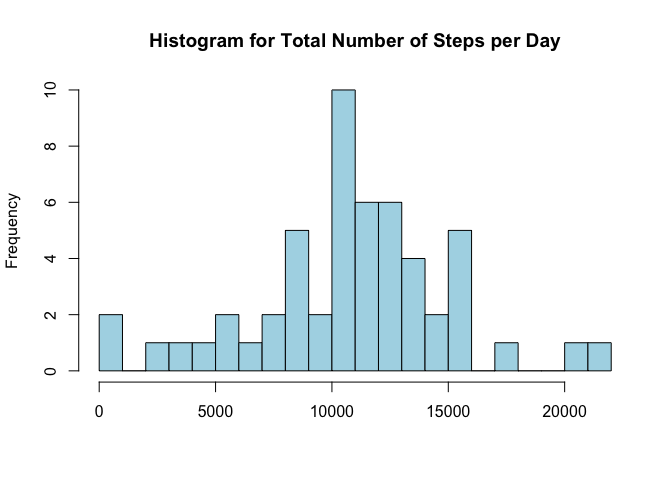
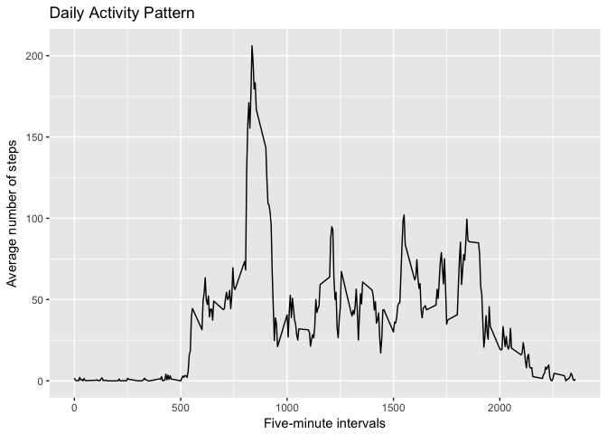
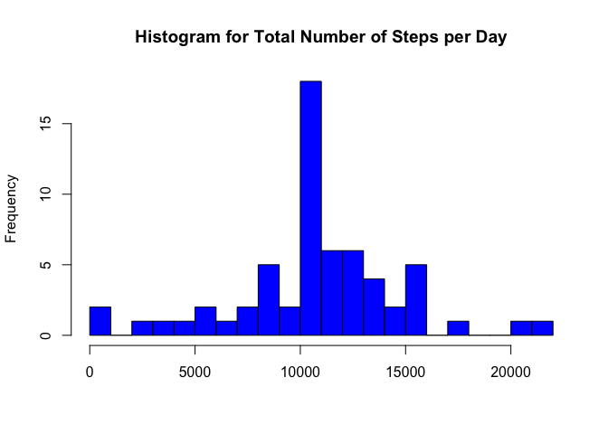
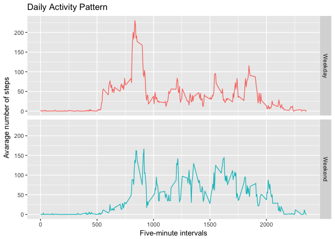

# Reproducible Research: Peer Assignment 1
2/18/2017  


### Loading packages needed for analysis


```r
library(ggplot2)
library(plyr)
library(dplyr)
library(lattice)
```


### Loading and preprocessing the data


```r
# Load data
unzip("activity.zip")
data <- read.csv("activity.csv")

# Format date variable
data$date <- as.Date(data$date, format = "%Y-%m-%d")

# Check data
str(data)
```

```
## 'data.frame':	17568 obs. of  3 variables:
##  $ steps   : int  NA NA NA NA NA NA NA NA NA NA ...
##  $ date    : Date, format: "2012-10-01" "2012-10-01" ...
##  $ interval: int  0 5 10 15 20 25 30 35 40 45 ...
```

Summary statistics for the variables `steps`


```r
# Summary statistics 
summary(data$steps)
```

```
##    Min. 1st Qu.  Median    Mean 3rd Qu.    Max.    NA's 
##    0.00    0.00    0.00   37.38   12.00  806.00    2304
```

### What is the mean total number of steps taken per day?

The histogram below shows the total number of steps taken each day.


```r
# Total number of steps per day
data_day <- ddply(data, .(date), summarise, tot_steps=sum(steps))

# Histogram for total number of steps per day
hist(data_day$tot_steps, breaks = 25, 
        main = "Histogram for Total Number of Steps per Day", 
        xlab = "", col = "lightblue")
```

<!-- -->

The mean and median total number of steps taken per day


```r
# Mean total number of steps per day
mean <- mean((data_day$tot_steps), na.rm = TRUE)
mean
```

```
## [1] 10766.19
```

```r
# Median total number of steps per day
median <- median((data_day$tot_steps), na.rm = TRUE)
median
```

```
## [1] 10765
```


### What is the average daily activity pattern?

The plot below shows the average number of steps taken, averaged across all days, by 5-minute intervals.


```r
# Average number of steps by interval
data_interval <- ddply(data, .(interval), 
                       summarise, mn_steps=mean(steps, na.rm = TRUE))

# Line graph of average daily activity pattern
ggplot(data = data_interval, aes(x = interval, y = mn_steps)) + 
        geom_line() +
        ggtitle("Daily Activity Pattern") + 
        labs( x="Five-minute intervals", y="Average number of steps") 
```

<!-- -->

The 5-minute interval with the maximum number of steps across all the days.


```r
# Interval with max number of steps
data_interval[which.max(data_interval$mn_steps), 1]
```

```
## [1] 835
```

### Imputing missing values

The total number of missing values in the dataset.


```r
# Total number of missing values
sum(is.na(data))
```

```
## [1] 2304
```

A new dataset with the missing values replaced by the mean steps per 5-minute interval across time.


```r
# Place holder for variable with NAs
data$steps_old <- data$steps

# Merge and replace original data (i.e. NAs) with interval data
newdata <- within(merge(data, data_interval, by='interval'), {
        steps <- ifelse(is.na(steps), mn_steps, steps)
})

# Re-order columns
newdata <- subset(newdata, select=c(1,3,4,5,2))

# Sort by date and interval
newdata <- newdata[order(newdata$date, newdata$interval),]

# Check data
str(newdata)
```

```
## 'data.frame':	17568 obs. of  5 variables:
##  $ interval : int  0 5 10 15 20 25 30 35 40 45 ...
##  $ date     : Date, format: "2012-10-01" "2012-10-01" ...
##  $ steps_old: int  NA NA NA NA NA NA NA NA NA NA ...
##  $ mn_steps : num  1.717 0.3396 0.1321 0.1509 0.0755 ...
##  $ steps    : num  1.717 0.3396 0.1321 0.1509 0.0755 ...
```

As shown above, the missing values from the first estimates were replaced correctly by the average number of steps per interval across time. Now, we can remove the variables used to check that we merged and replaced the missing values. 


```r
newdata$steps_old <- NULL
newdata$mn_steps <- NULL
```

The histogram below shows the total number of steps taken each day using the new dataset.  


```r
# Total number of steps per day
newdata_day <- ddply(newdata, .(date), 
                     summarise, tot_steps=sum(steps))

# Histogram for total number of steps per day
hist(newdata_day$tot_steps, breaks = 25, main = "Histogram for Total Number of Steps per Day", 
        xlab = "", col = "blue")
```

<!-- -->

The mean and median total number of steps taken per day.


```r
# Mean total number of steps per day
mean_new <- mean((newdata_day$tot_steps), na.rm = TRUE)

# Median total number of steps per day
median_new <- median((newdata_day$tot_steps), na.rm = TRUE)

# Table comparing means and medians
x <- matrix(c(10766.19, 10765, 10766.19, 10766.19), byrow = TRUE, 2, 2)
colnames(x) <- c('Mean', 'Median')
rownames(x) <- c('Original', 'Filled')
as.table(x)
```

```
##              Mean   Median
## Original 10766.19 10765.00
## Filled   10766.19 10766.19
```

The median from the new estimates is slightly higher, while the mean for both datasets are the same. The impact of imputing missing data on the estimates barely changes the estimates.


### Are there differences in activity patterns between weekdays and weekends?

A new factor variable with two levels – “Weekday” and “Weekend” indicating whether a given date is a weekday or weekend day.


```r
# Create a new variable to store day of the week
dow <- function(x) format(as.Date(x), "%A")
newdata$day <- dow(newdata$date)

# Create daytype variable with two levels
newdata <- mutate(newdata, daytype = ifelse(day %in% c("Saturday","Sunday"),"Weekend","Weekday"))

# Check data
str(newdata)
```

```
## 'data.frame':	17568 obs. of  5 variables:
##  $ interval: int  0 5 10 15 20 25 30 35 40 45 ...
##  $ date    : Date, format: "2012-10-01" "2012-10-01" ...
##  $ steps   : num  1.717 0.3396 0.1321 0.1509 0.0755 ...
##  $ day     : chr  "Monday" "Monday" "Monday" "Monday" ...
##  $ daytype : chr  "Weekday" "Weekday" "Weekday" "Weekday" ...
```

A table showing the number of observations for weekday days and weekend days.


```r
# Number of observations per daytype
table(newdata$daytype)
```

```
## 
## Weekday Weekend 
##   12960    4608
```

The panel below shows the average number of steps taken, averaged across all weekday days or weekend days, by 5-minute intervals.


```r
# Average number of steps by interval
newdata_interval <- ddply(newdata, .(interval, daytype), 
                          summarise, mn_steps=mean(steps, na.rm = TRUE))

# Panel chart
ggplot(newdata_interval, aes(interval, mn_steps, colour=daytype)) + 
        geom_line() + 
        facet_grid(daytype ~ .) +
        ggtitle("Daily Activity Pattern") +
        labs(x="Five-minute intervals", y="Avarage number of steps") +
        theme(legend.position="none")
```

<!-- -->
